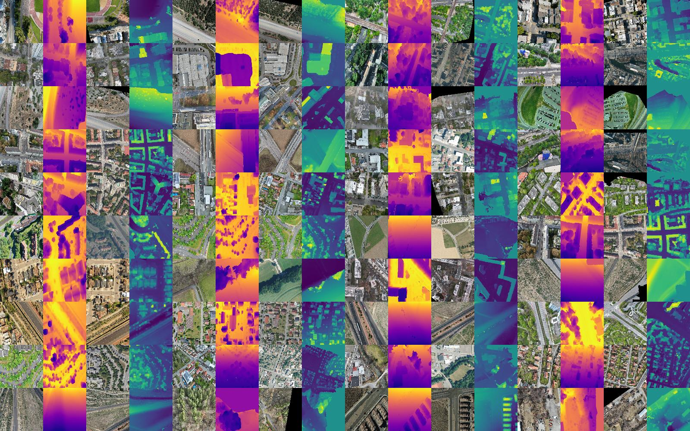
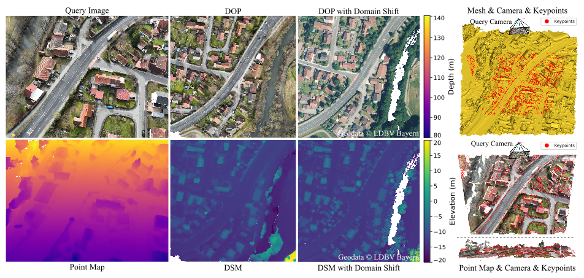

<div align="center">

  <h1>✈️🌍️: OrthoLoC: UAV 6-DoF Localization and Calibration Using Orthographic Geodata</h1>

<!-- Badges -->
<p>
  <a href="https://deepscenario.github.io/OrthoLoC/">
    
  </a>
  <a href="">
    
  </a>
  <a href="https://github.com/deepscenario/OrthoLoC/stargazers">
    
  </a>
  <a href="https://github.com/deepscenario/OrthoLoC/blob/master/LICENSE">
    
  </a>
</p>
</div>

<div align="center">
  
</div>

<p>
🎯 We present a new paradigm for UAV camera localization and calibration using geospatial data (geodata), specifically orthophotos (DOPs) and digital surface models (DSMs).
This approach is particularly useful for UAVs operating in urban environments, where traditional localization methods may struggle due to the complexity of the surroundings. By leveraging geodata, we can achieve accurate localization and calibration even in challenging conditions.
We propose a large-scale benchmark dataset for UAV visual localization, which includes a diverse set of images and geodata from various environments. This dataset serves as a valuable resource for researchers and practitioners in the field, enabling them to develop and evaluate new localization algorithms.
</p>

<!-- Table of Contents -->

# :notebook_with_decorative_cover: Table of Contents

- [⭐ About the Project](#About-the-Project)
- [🔍 Dataset Features](#Dataset-Features)
- [📊 Dataset Samples](#Dataset-Samples)
- [🧰 Getting Started](#Getting-Started)
    * [❗ Prerequisites](#Prerequisites)
    * [⚙️ Installation](#Installation)
    * [📥 Download the Dataset](#Download-the-Dataset)
    * [📂 Structure of the Dataset](#Structure-of-the-Dataset)
- [🔧 Usage](#Usage)
- [🏃 Run Scripts](#Run-Scripts)
    * [🔄 Matching Only](#Matching-Only)
    * [📍 Localization and/or Calibration](#Localization-and-Calibration)
    * [📏 Benchmarking](#Benchmarking)
    * [👁️ Visualization of a Sample](#Visualization-of-a-Sample)
    * [🖼️ Visualization of Samples in the Dataset](#Visualization-of-Dataset-Samples)
- [⚠️ License](#License)
- [🙏 Acknowledgements](#Acknowledgements)

<a name="About-the-Project"></a>

## :star2: About the Project

OrthoLoC is a framework for UAV camera localization and calibration using orthographic geodata. The project provides a
large-scale dataset and implementation of algorithms for matching, localization, and calibration of UAV
imagery using orthophotos and digital surface models.

<a name="Dataset-Features"></a>

## :mag: Dataset Features

- **📸 Large-scale Dataset:** **16,427** high-resolution UAV images with high-precision camera parameters (intrinsics +
  extrinsics), sourced from **multiple** geographic environments (Europe + US).
- **🛫 Multi-altitude:** Imagery captured at **varied altitudes** (23m-154m), offering diverse perspectives and coverage.
- **🔄 Multi-viewpoint:** Diverse viewpoints with wide camera angles (tilting: 0°-86.8°), offering challenging and
  dynamic perspectives.
- **🌍 Multi-geographic Environments:** Coverage of **urban** 🏙️, **rural** 🌾, **highway** 🚗, and **suburban** 🏡
  landscapes, with high-res geodata alignment.
- **📍 High-precision Ground-truth:** Paired UAV-geodata images for precise localization and calibration, minimizing
  retrieval errors and ensuring accuracy.
- **🌐 Geospatial Alignment:** Well-aligned orthographic maps (orthophotos and elevation maps) for precise UAV
  localization and calibration.
- **🔬 Real-world Applicability:** A foundation for evaluating decoupled UAV localization and calibration, enabling
  practical, real-world use cases.

<a name="Dataset-Samples"></a>

## :bar_chart: Dataset Samples

<div align="center"> 
  
</div>

<a name="Getting-Started"></a>

## :toolbox: Getting Started

<a name="Prerequisites"></a>

### :bangbang: Prerequisites

- Python 3.10

<a name="Installation"></a>

### :gear: Installation

#### via pip

To install the package, you can use pip to install it directly from GitHub (this might take a while):

```
pip install git+https://github.com/deepscenario/OrthoLoC.git
```

#### via git clone

Clone the project

```
git clone https://github.com/deepscenario/OrthoLoC.git
```

Install the library

```
cd OrthoLoC
pip install -e .
```

<a name="Download-the-Dataset"></a>

### :inbox_tray: Download the Dataset

Our dataset is available here: [OrthoLoC Dataset](https://cvg.cit.tum.de/webshare/g/papers/Dhaouadi/OrthoLoC/)

#### Important Notes:

- You can either download the dataset manually or let our scripts do it for you.
- You can directly use urls when using our scripts or relative paths to the dataset.
    - Example of a relative path: `"demo/samples/highway_forest.npz"` will automatically
      download https://cvg.cit.tum.de/webshare/g/papers/Dhaouadi/OrthoLoC/demo/samples/highway_forest.npz
    - Example of an URL: `"https://cvg.cit.tum.de/webshare/g/papers/Dhaouadi/OrthoLoC/full/test_inPlace/"` as
      dataset_dir of
      the dataset
      will automatically download the full folder.
- The dataset will be downloaded to the default cache directory in your system. E.g. on ubuntu, it will be downloaded to
  `~/.cache/ortholoc/`. You can change the cache directory by setting the environment variable `ORTHOLOC_CACHE_DIR` to
  your desired path.
- Not setting `--dataset_dir` in the scripts will automatically download the dataset (on-demand) to the cache directory.

### :file_folder: Structure of the Dataset

<a name="Structure-of-the-Dataset"></a>

```
├── demo                                   # example data
│   ├── urban_residential.jpg              # query image
│   ├── urban_residential_DOP.tif          # DOP image as tif file
│   ├── urban_residential_DSM.tif          # DSM image as tif file
│   ├── urban_residential_extrinsics.json  # extrinsics of the query image as json file (for evaluation only)
│   ├── urban_residential_intrinsics.json  # intrinsics of the query image as json file
│   ├── urban_residential_xDOP.tif         # DOP with cross domain as tif file
│   ├── urban_residential_xDSM.tif         # DSM with cross domain as tif file
│   ├── samples                            # few samples from the dataset as .npz files
│   │   ├── highway_forest.npz
│   │   ├──  ...
├── full
│   ├── train
│   │   ├── L01_R0000.npz
│   │   ├──  ...
│   ├── val
│   │   ├── L01_R0014.npz
│   │   ├──  ...
│   ├── test_inPlace
│   │   ├── L01_R0012.npz
│   │   ├──  ...
│   ├── test_outPlace
│   │   ├── L08_R0000.npz
│   │   ├──  ...
```

The folder demo contains data in raw format (query image as .jpg and the geodata as .tif files) as well as folder called
samples containing a small subset of the dataset for quick testing and debugging purposes. The folder full
contains the full dataset. The dataset is divided into four parts: train, val, test_inPlace, test_outPlace. The train
and val
folders contain the samples for training and validation. The test_inPlace and test_outPlace folders contain the samples
for testing. The test_inPlace samples are taken from the same locations as in the train and val samples, while the
test_outPlace samples are taken from different locations.

The naming of the files follows the pattern: `L{location_id}_{type_of_the_sample}{sample_index}.npz`, where:

- **location_id**: The ID of the location (e.g. L01, L02, ...)
- **type_of_the_sample**: The type of the sample (e.g. "R" for same domain, "xDOP" for DOP domain shift, "xDSM" for DSM
  domain shift, "xDOPDSM" for DOP and DSM domain shift)

### Sample

<div align="center"> 
  
</div>

Each .npz file contains the following
keys: ['sample_id', 'image_query', 'point_map', 'image_dop', 'dsm', 'scale', 'extrinsics', 'intrinsics', 'keypoints', 'vertices', 'faces', 'extrinsics_refined']

- **sample_id**: The ID of the sample as string
- **image_query**: The query image as numpy array of shape (H, W, 3)
- **point_map**: The point map as numpy array of shape (H, W, 3)
- **image_dop**: The DOP image as numpy array of shape (H_geo, W_geo, 3), H_geo = W_geo = 1024
- **dsm**: The DSM image as numpy array of shape (H_geo, W_geo, 3), H_geo = W_geo = 1024
- **scale**: The scale of a single pixel in the DOP and DSM images in meters
- **extrinsics**: The extrinsics (world to cam) of the query image as numpy array of shape (3, 4) derived from 3D
  reconstruction
- **intrinsics**: The intrinsics of the query image as numpy array of shape (3, 3)
- **keypoints**: The 3D keypoints of the query image as numpy array of shape (N, 3)
- **vertices**: The 3D vertices of the local mesh as numpy array of shape (M, 3)
- **faces**: The faces of the local mesh as numpy array of shape (L, 3)
- **extrinsics_refined**: Camera pose parameters as numpy array of shape (3, 4) optimized to compensate for
  rasterization artifacts and missing 0.5D information (building facades) in the DSM. Computed using ground truth
  correspondences between query images and DOP/DSM data via PnP RANSAC. Provided for research purposes but not used in
  official benchmarking.

<a name="Usage"></a>

## :wrench: Usage

To use the dataset as a PyTorch Dataset, you can do the following:

```
from ortholoc.dataset import OrthoLoC

dataset = OrthoLoC(
    dataset_dir=None,  # path to the dataset, if empty, the dataset will be downloaded automatically
    sample_paths=None,  # path to the samples (cannot be specified when dataset_dir is set), e.g. ["demo/samples/highway_rural.npz", "demo/samples/urban_residential_xDOPDSM.npz"]
    set_name='all',  # name of the set (all, train, val, test_inPlace, test_outPlace)
    start=0.,  # start of the dataset
    end=1.,  # end of the dataset
    mode=0,  # mode 0 for all samples, 1 for samples with same UAV imagery and geodata domain, 2 for samples with DOP domain shift, 3 for samples with DOP and DSM domains shift
    new_size=None,  # new size of the images (useful for training)
    limit_size=None,  # limit size of the images (useful for debugging)
    shuffle=True,  # shuffle the dataset
    scale_query_image=1.0,  # scale of the query image (1.0 keep the original size)
    scale_dop_dsm=1.0,  # scale of the DOP and DSM images
    gt_matching_confidences_decay=1.0,  # decay of the matching confidences (the larger the less confident will be the GT for non-unique points like points on facades)
    covisibility_ratio=1.0,  # ratio of the covisibility (0.0 to 1.0, 0.0 exclusive, the larger the more area in the geodata will be visible for the UAV)
    return_tensor=False,  # return the samples while iterating over the dataset as dict of torch tensors
    predownload=False,  # if True, it will download the dataset while constructing the dataset object, otherwise it will download while iterating over the dataset
)
```

<a name="Run-Scripts"></a>

## :running: Run Scripts

For each script, consult the help message for more options.
All the weights for matching algorithms will be downloaded automatically.

<a name="Matching-Only"></a>

### :repeat: Matching Only

To run the image matching from a sample of the dataset or from two images, you can do the following:

```
run-matching --sample assets/demo/samples/urban_residential_xDOPDSM.npz --matcher Mast3R --device cuda --angles 0 --show  
```

<a name="Localization-and-Calibration"></a>

### :round_pushpin: Localization and/or Calibration

To run the localization and/or calibration from a sample of the dataset or from custom data, you can do the following:

```
run-localization --sample assets/demo/samples/highway_rural.npz --matcher Mast3R --device cuda --angles 0 --show 
```

You can use your own images and geodata by specifying the paths to the files directly:

```
run-localization --image assets/demo/urban_residential.jpg --dop assets/demo/urban_residential_DOP.tif --dsm assets/demo/urban_residential_DSM.tif --intrinsics assets/demo/urban_residential_intrinsics.json --matcher Mast3R --device cuda --angles 0 --show 
```

**Important notes:**

- If you do not provide intrinsics parameters, the system will automatically estimate them (performing calibration).
- Ensure your geodata covers the area visible in the query image. The localization and calibration framework requires
  sufficient overlap between the query image and geodata. Using geodata with large areas not visible in the query image
  may lead to poor results.

<a name="Benchmarking"></a>

### :straight_ruler: Benchmarking

To benchmark performance across a set of samples from the dataset or custom data:

```
run-benchmark --dataset_dir assets/demo/samples/ --output_dir ./output/ --matcher Mast3R --device cuda
```

<a name="Visualization-of-a-Sample"></a>

### :eye: Visualization of a Sample

To visualize a single sample from the dataset:

```
visualize-sample --sample assets/demo/samples/highway_rural.npz --show
```

<a name="Visualization-of-Dataset-Samples"></a>

### :framed_picture: Visualization of Samples in the Dataset

To create a visualization of some samples in a dataset directory:

```
visualize-dataset --dataset_dir assets/demo/samples/ --n_scenes 5 --show
```

<a name="License"></a>

## :warning: License

Distributed under CC BY-NC-SA 4.0. See LICENSE.md for more information.
For licenses of the matching methods used in the project, please refer to the respective repositories.

<a name="Acknowledgements"></a>

## :pray: Acknowledgements

This work is a result of the joint research project STADT:up. The project is supported by the German Federal Ministry
for Economic Affairs and Climate Action (BMWK), based on a decision of the German Bundestag. The author is solely
responsible for the content of this publication.

Special thanks to [Vincentqyw](https://github.com/Vincentqyw) for developing
the [Image Matching WebUI](https://github.com/Vincentqyw/image-matching-webui). This tool provides a user-friendly
interface for matching between images using various state-of-the-art algorithms.

Big thanks to the German government for making geospatial data freely available to everyone. These open data portals are
a goldmine for developers, researchers, and anyone curious about spatial information. Here's where you can find them:

### 🇩🇪 State Open Data Portals

- **Bavaria**: [geodaten.bayern.de/opengeodata](https://geodaten.bayern.de/opengeodata/)
- **Berlin**: [gdi.berlin.de](https://www.berlin.de/sen/sbw/stadtdaten/geoportal/)
- **Hesse**: [gds.hessen.de](https://gds.hessen.de/)
- **Hamburg**: [geoportal-hamburg.de](https://www.geoportal-hamburg.de/)
- **North Rhine-Westphalia**: [opengeodata.nrw.de](https://www.opengeodata.nrw.de/)
- **Baden-Württemberg**: [opengeodata.lgl-bw.de](https://opengeodata.lgl-bw.de/)

